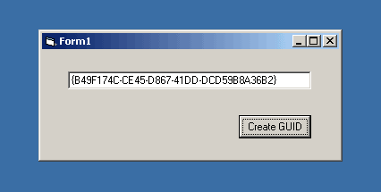



## GUID \(Global Unique Identification Number\) using API

### Description

The code bellow creates a Global Unique Identification Number (GUID), using the CoCreateGuid API found in OLE32.DLL on Windows 95, Windows 98, Windows Me, Windows NT and Windows 2000. The created GUID has five parts that represent the individual parts separated by dashes that you would see when viewing a CLSID or GUID in the system registry.
 
### More Info
 
The five parts of the GUID separeted by dashes.

             |
---                |---
**Submitted On**   |2001-07-21 17:29:30
**By**             |[Vassilis Antonoulas](https://github.com/Planet-Source-Code/PSCIndex/blob/master/ByAuthor/vassilis-antonoulas.md)
**Level**          |Advanced
**User Rating**    |4.8 (48 globes from 10 users)
**Compatibility**  |VB 6\.0
**Category**       |[Miscellaneous](https://github.com/Planet-Source-Code/PSCIndex/blob/master/ByCategory/miscellaneous__1-1.md)
**World**          |[Visual Basic](https://github.com/Planet-Source-Code/PSCIndex/blob/master/ByWorld/visual-basic.md)
**Archive File**   |[GUID \(Glob232067212001\.zip](https://github.com/Planet-Source-Code/vassilis-antonoulas-guid-global-unique-identification-number-using-api__1-25290/archive/master.zip)

